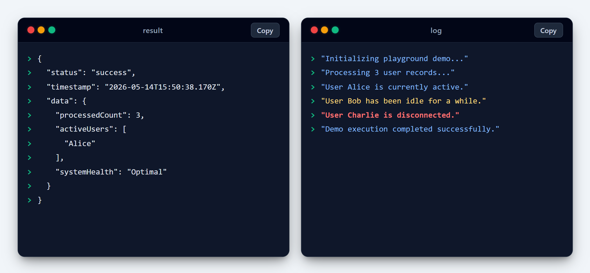

# TypeScript Playground



## Overview

The **TypeScript Playground** is a modern, high-contrast, and interactive development environment built for rapid experimentation and prototyping. It combines the power of React and TypeScript with a sleek, developer-centric UI to provide a premium coding experience.

## Project Goal

The primary objective of this project is to create a seamless and aesthetically pleasing playground where developers can:

- **Rapidly Prototype**: Test out TypeScript logic and React components with zero friction.
- **Instant Feedback**: Experience ultra-fast updates through Hot Module Replacement (HMR).
- **Modular Execution**: Run scripts and view outputs in a modular, on-demand flow.
- **Aesthetic Excellence**: Develop in a high-contrast, modern interface designed for focus and productivity.

## Key Features

- **Powered by Vite**: Blazing fast development server and build process.
- **Modern UI/UX**: High-contrast theme with glassmorphism and smooth animations.
- **Modular Design**: Script execution and UI views are decoupled for maximum flexibility.
- **SCSS Modules**: Scoped and maintainable styling using modern CSS practices.
- **Real-time HMR**: See your changes instantly as you type.

## Getting Started

1. **Install Dependencies**:

    ```bash
    npm install
    ```

2. **Run the Development Server**:

    ```bash
    npm run dev
    ```

3. **Start Coding**:
   Open `content/main.ts` or `content/Main.tsx` and start building!
